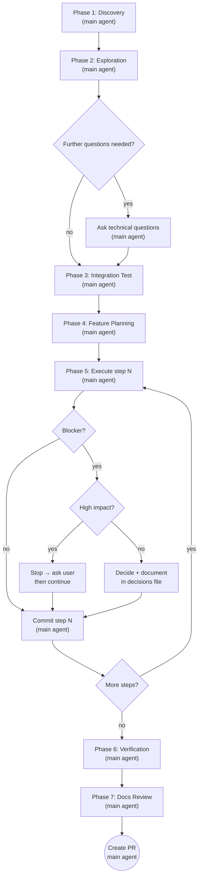

# Building Features

## Overview

Full feature development workflow from first description to open PR. **The main agent does all work directly** – no subagents. After each phase, the main agent outputs a context status indicator.

**Preconditions:** Git repo + remote configured. Missing directories (`docs/plans/`, `docs/decisions/`) are created automatically.

## Context Status

After every phase, output a context status line:

```
📊 Kontext: [████████░░] ~80% — Phase N abgeschlossen
```

Use a rough estimate based on conversation volume:
- Few exchanges, small codebase read → ~10–30%
- Several phases done, many files read → ~40–60%
- Many files read, large plan + multiple execution steps → ~70–90%

If you sense the context is getting full (>80%), warn the user:
> ⚠️ Kontext ist fast voll. Ich fasse wichtige Informationen zusammen, bevor wir weitermachen.
Then summarize the key findings from all previous phases in a compact block before continuing.

---

## Process Flow



---

## Phase 1 – Discovery

Use `AskUserQuestion` to ask clarifying **business/domain** questions – one at a time. No technical details, no code.

End by summarizing understanding in 3–5 sentences and asking: "Ist das korrekt? Dann starte ich die technische Exploration." Wait for confirmation before proceeding.

**Output after confirmation:**

```
## Fachliche Zusammenfassung
[3-5 sentences]

## Offene fachliche Punkte
[any unresolved domain questions]
```

Then output context status.

---

## Phase 2 – Exploration

**Before exploring the codebase:** Read `docs/explanation/service.md` first to gain architectural context.

Explore the codebase and produce findings in this format:

```markdown
## Architektur-Kontext

- Key facts from docs/explanation/service.md relevant to this feature

## Relevante Dateien

- `path/to/file` – why relevant

## Bestehende Patterns

- Pattern: description + example file

## Abhängigkeiten & Schnittstellen

- what depends on what

## Offene technische Fragen

- questions that could not be answered from the codebase
```

**If feature is already partially implemented:** Inform user and adjust plan accordingly.

After exploration: ask remaining technical questions if needed (one at a time using `AskUserQuestion`).

Then output context status.

---

## Phase 3 – Integration Test Planning & Implementation

### Phase 3a – Integration Test Planning

Design a high-level integration test that validates the feature end-to-end using:
- `@SpringBootTest` for Spring Boot context
- **TestContainers** for external dependencies (database, message broker, etc.)

**Test plan format:**

```
## Integration Test: [Feature Name]

**Ziel:** What the test validates (end-to-end happy path or critical flow)

**Setup:**
- Which TestContainers are needed (Postgres, MySQL, Redis, RabbitMQ, etc.)
- What initial data or configuration is required

**Test Szenarios:**
- Scenario 1: [description]
- Scenario 2: [description]

**Assertions:** What the test verifies (response, side effects, database state, etc.)
```

Present plan via `AskUserQuestion`. Approval follows same rules as Phase 4. Save test plan to `docs/plans/YYYY-MM-DD-<feature-name>-integration-test.md`.

### Phase 3b – Integration Test Implementation

Implement the integration test after plan approval:

1. Create test class(es) in `src/test/java/...` with proper structure
2. Configure TestContainers (in `testcontainers.properties` or via code)
3. Set up `@SpringBootTest` with correct `webEnvironment`
4. Implement test scenarios from the plan
5. Add assertions matching the plan
6. Run test to verify it compiles and executes (may fail on unimplemented feature – that's OK)

Commit following the [commit skill](./../commit/SKILL.md) with type `test`.

Then output context status.

---

## Phase 4 – Feature Planning

Create a high-level plan and present it via `AskUserQuestion`. Iterate on feedback until approved.

**Architecture:** This project uses hexagonal architecture. Plan steps must follow the layer structure defined in the [hexagonal-arch skill](./../hexagonal-arch/SKILL.md). Read that skill before planning.

**Plan step format:**

```
## Schritt N: [Short title]
**Layer/Bereich:** Domain / Application / Adapter-In (REST) / Adapter-Out (Persistence) / Adapter-Out (HTTP) / Infrastruktur / ...
**Was passiert:** 1-2 sentences describing what changes
```

**Approval:** Any positive response counts (ja, ok, go, lgtm, approved, passt, sieht gut aus). Silence or rejection does not count.

Save plan to `docs/plans/YYYY-MM-DD-<feature-name>.md`.

Then output context status.

---

## Phase 5 – Execution (one step at a time, sequential)

Execute each plan step directly. Reference the exploration findings, current decisions file (if exists), and the [hexagonal-arch skill](./../hexagonal-arch/SKILL.md) as architecture reference. Follow the naming conventions, package structure, and patterns defined there.

**No confirmation questions** for normal implementation decisions.

**Blocker logic:**

| Impact      | Action                                                                     |
| ----------- | -------------------------------------------------------------------------- |
| High impact | Stop → ask user via `AskUserQuestion` → continue after answer              |
| Low impact  | Decide independently, document in `docs/decisions/YYYY-MM-DD-<feature>.md` |

**High impact examples:** unplanned DB schema change, sync vs. async decision, external API differs from assumptions, security-relevant choice

**Low impact examples:** variable/method names, internal implementation details, validation order, log format

After each step: commit following the [commit skill](./../commit/SKILL.md), then output context status.

---

## Phase 6 – Verification

Run all checks sequentially. A failure stops subsequent steps.

1. Tests → if failing: try to fix once; if unresolvable → stop, report to user
2. Linting → auto-fix
3. Formatting → auto-fix
4. Build → if failing → stop, report to user with exact error

Then output context status.

---

## Phase 7 – Docs Review

Check whether the architecture doc is still accurate after the feature was built:

1. Read `docs/explanation/service.md`
2. Review what changed in Phase 5 (new collections, new endpoints, new integrations, renamed concepts, etc.)
3. Update the doc where it is now outdated or incomplete – keep the same concise style
4. If nothing changed: note "Keine Änderungen nötig"

**Scope:** Only update `docs/explanation/service.md`. No other docs.

If the doc was changed, commit following the [commit skill](./../commit/SKILL.md) with type `ai(docs)`.

Then create PR:

**PR format:**

```
Title: feat(scope): short description   ← see commit skill

Body:
## Summary
- Step 1: what was done
- Step 2: what was done

## Plan
See: docs/plans/YYYY-MM-DD-<feature>.md

## Decisions
[only if exists] See: docs/decisions/YYYY-MM-DD-<feature>.md

🤖 Generated with Claude Code
```

---

## Decisions File Format

`docs/decisions/YYYY-MM-DD-<feature>.md` – one file per feature, all low-impact decisions collected:

```markdown
# Decisions: <feature name>

## <Schritt N> – <short title>

**Entscheidung:** What was decided
**Grund:** Why
```
